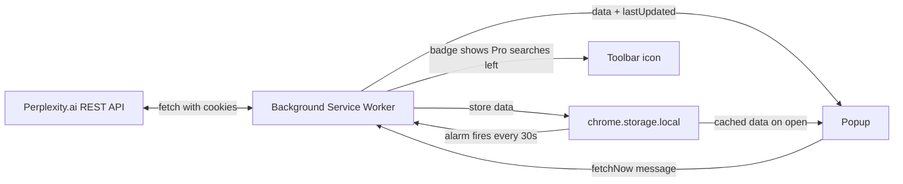

# Perplexity Limit Tracker

A Manifest V3 Chrome extension that shows your **remaining Perplexity Pro usage limits** directly in the toolbar — no need to open Perplexity.ai to check how many searches, research requests, or file uploads you have left.

## What it does

When you are logged in to Perplexity.ai, the extension queries Perplexity's own rate-limit endpoints and displays your remaining quota for:

| Displayed field | Meaning |
|---|---|
| **Pro Searches** | Standard Pro searches left (also shown as a number on the toolbar badge) |
| **Research** | Deep research queries left |
| **Labs** | Lab / experimental features usage left |
| **Agentic Research** | Agentic research queries left |
| **Upload Limit** | Current file-upload allowance |
| **Daily Attachments** | File attachments used / allowed today |
| **Weekly Attachments** | File attachments used / allowed this week |

The data refreshes automatically **every 30 seconds** while Chrome is running, and you can force a refresh at any time with the **Refresh Now** button in the popup.

## How it works

The extension reads two (undocumented, public) Perplexity REST endpoints that the Perplexity web app itself uses:

- `https://www.perplexity.ai/rest/rate-limit/all` — returns `remaining_pro`, `remaining_research`, `remaining_labs`, `remaining_agentic_research`, etc.
- `https://www.perplexity.ai/rest/user/settings` — returns the upload / attachment limits.

> ⚠️ These endpoints are **not an official public API**. They may change or require authentication at any time. If the extension shows an error, first make sure you are logged in to perplexity.ai in the same browser.

### Architecture

- **`background.js` (service worker)** — the *only* component that talks to Perplexity. It:
	1. Fetches both endpoints on install, on browser startup, and whenever a 30-second alarm fires.
	2. Validates the response shape (must contain `remaining_pro`).
	3. Combines the results and stores them in `chrome.storage.local` (`limitsData`, `lastUpdated`, and `lastError` on failure).
	4. Updates the toolbar badge with the number of Pro searches remaining (`?` on error).
	5. Answers `fetchNow` messages from the popup, so all fetching happens in one place.
- **`popup.js` / `popup.html`** — the UI you see when you click the toolbar icon. When the popup opens it first shows cached data (instant display), and requests a fresh fetch from the background worker when there is no cache or after an error. The **Refresh Now** button always remains available so you can retry after an error.
- **`chrome.storage.local`** — shared cache between the worker and the popup, so the badge and the popup never disagree.

### File map

| File | Role |
|---|---|
| `manifest.json` | MV3 manifest: permissions (`storage`, `alarms`), host permission for `www.perplexity.ai`, popup definition, background service worker |
| `background.js` | Fetches + validates the data, keeps the badge current, answers popup requests, schedules the 30 s auto-refresh |
| `popup.html` | Popup layout and styling |
| `popup.js` | Popup logic: renders cached data, triggers refreshes, shows loading/error states |

## Installation (developer mode)

1. Clone or download this repository.
2. Open Chrome and go to `chrome://extensions`.
3. Enable **Developer mode** (toggle in the top-right corner).
4. Click **Load unpacked** and select the project folder.
5. Log in to [perplexity.ai](https://www.perplexity.ai) in the same Chrome profile, then pin the extension from the toolbar menu.

## Usage

- **Toolbar badge** always shows your remaining Pro searches.
- **Click the icon** to see the full breakdown (Pro / Research / Labs / Agentic / Uploads).
- **Refresh Now** forces an immediate update.
- The data **auto-refreshes every 30 seconds**.

## Troubleshooting

- **"Not authenticated. Please log in to Perplexity.ai first."** → You are not logged in, or your session expired. Open [perplexity.ai](https://www.perplexity.ai) and log in, then click *Refresh Now*.
- **"API error: 4xx/5xx"** → Perplexity's endpoint returned an unexpected status. This can happen if Perplexity changes their endpoints; try again later.
- **"Unexpected API response format"** → Perplexity changed the shape of their response. Update the validation in `background.js`/`popup.js` accordingly.

## Privacy & security notes

- The extension only requests permission for **`https://www.perplexity.ai/*`** — it cannot read your data on other sites.
- Network requests are made **only to Perplexity.ai**, using your own Perplexity session cookies (`credentials: 'include'`). No data is sent anywhere else.
- All usage data stays in **`chrome.storage.local`** on your machine — nothing is uploaded or tracked by the extension.
- All values returned by the API are **HTML-escaped** before being inserted into the popup (`escapeHtml`), and responses are shape-validated before being stored or displayed, to protect against malformed/compromised API responses.
- If you are not a Perplexity Pro subscriber, most limits will show as `N/A`.

## Disclaimer

This extension is an independent hobby project and is **not affiliated with, endorsed by, or sponsored by Perplexity AI**. It relies on endpoints used by the Perplexity web app, which are subject to change without notice and may be restricted at any time. Use at your own risk.
